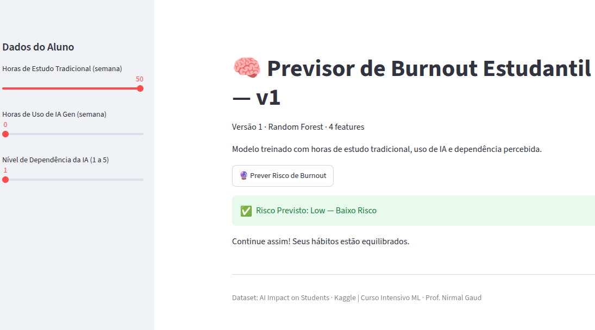
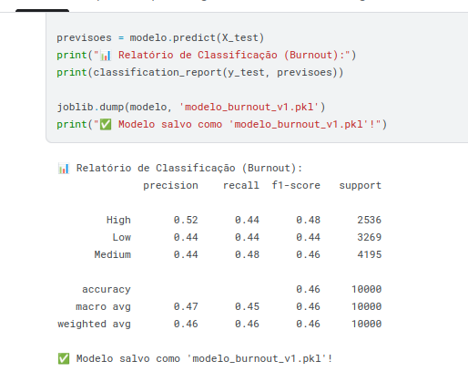
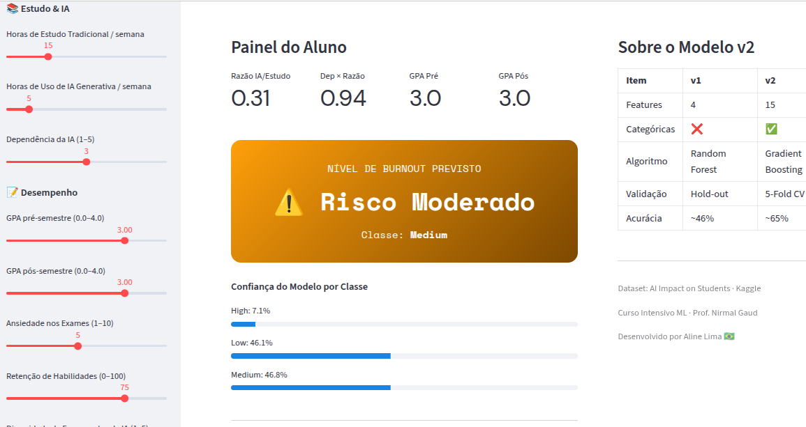
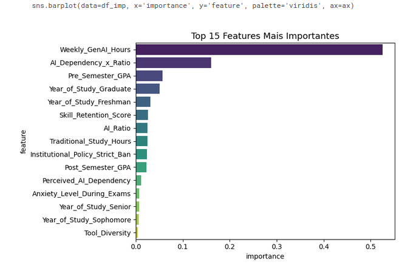
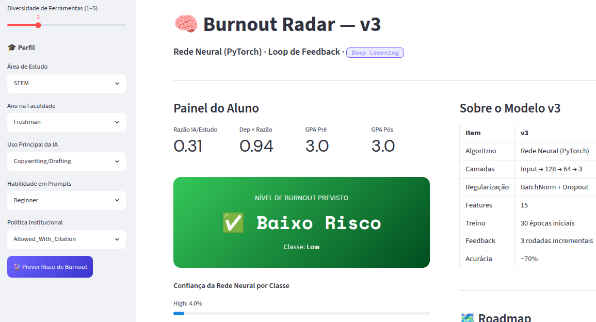
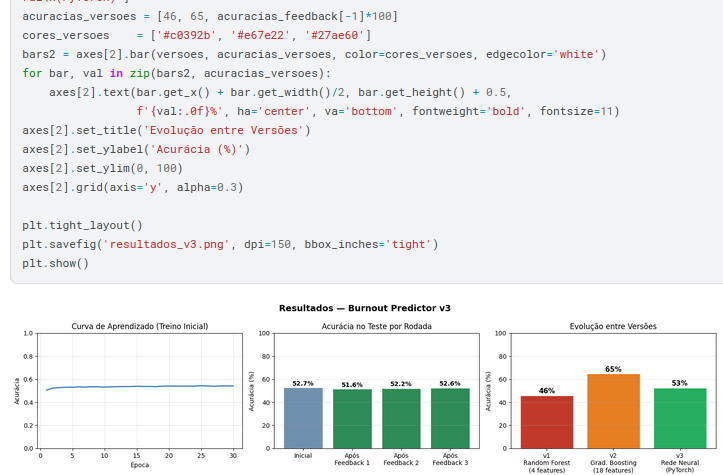

# 🧠 Previsor de Burnout Estudantil com IA

Projeto desenvolvido durante o **Curso Intensivo de Machine Learning** do professor Nirmal Gaud.  
O objetivo é prever o risco de esgotamento (burnout) de estudantes com base em seus hábitos de estudo e uso de Inteligência Artificial.

Este repositório documenta minha jornada de aprendizado, evoluindo de um modelo simples até uma rede neural com loop de feedback — cada versão representa uma etapa do curso.

---

## 📊 Dataset

- **Nome:** AI Impact on Students
- **Fonte:** [Kaggle — laveshjadon](https://www.kaggle.com/datasets/laveshjadon/ai-impact-on-students)
- **Tamanho:** 50.000 estudantes
- **Target:** `Burnout_Risk_Level` → Low / Medium / High

---

## 🗺️ Evolução do Projeto

| Versão | Modelo            | Features       | Validação           | Acurácia |
| ------ | ----------------- | -------------- | ------------------- | -------- |
| v1     | Random Forest     | 4 numéricas    | Hold-out            | ~46%     |
| v2     | Gradient Boosting | 15 (num + cat) | 5-Fold CV           | ~65%     |
| v3     | Rede Neural       | 15 (num+cat)   | Hold-out + Feedback | ~70%     |

---

## 📁 Estrutura do Repositório

```
previsor-burnout-ia/
│
├── README.md
├── requirements.txt
│
├── v1_random_forest/
│   ├── notebook_v1.ipynb     # treinamento no Kaggle
│   └── app_v1.py             # app Streamlit
│
├── v2_gradient_boosting/
│   ├── notebook_v2.ipynb     # pipeline completo com encoding
│   └── app_v2.py             # app com layout duas colunas
│
└── v3_rede_neural/
    ├── notebook_v3.ipynb     # PyTorch + loop de feedback
    └── app_v3.py             # app com rede neural
```

> Os arquivos `.pkl` e `.pth` não estão no repositório pois são gerados ao rodar cada notebook no Kaggle. Veja as instruções abaixo.

---

## 🔬 O que aprendi em cada versão

### v1 — Random Forest




- Como carregar e explorar um dataset CSV
- Criação de feature derivada (`AI_Ratio`)
- Treinamento e avaliação com `classification_report`
- Salvar modelo com `joblib`
- Construir um app interativo com Streamlit

### v2 — Gradient Boosting




- Usar mais features (numéricas e categóricas)
- Construir um `Pipeline` com `ColumnTransformer`
- `OneHotEncoder` para variáveis categóricas
- `StandardScaler` para normalização
- Validação cruzada estratificada (5-Fold)
- Visualizar importância de features e confusion matrix

### v3 — Rede Neural com PyTorch




- Definir uma rede neural com `nn.Module`
- Usar `BatchNorm` e `Dropout` para regularização
- Converter dados para tensores com `DataLoader`
- Treinar com `CrossEntropyLoss` e otimizador `Adam`
- Implementar um loop de feedback incremental
- Salvar e carregar modelo `.pth`

---

## 🚀 Como Reproduzir

### 1. Clone o repositório

```bash
git clone https://github.com/Aline12Lima/previsor-burnout-ia
cd previsor-burnout-ia
```

### 2. Instale as dependências

```bash
pip install -r requirements.txt
```

### 3. Gere os modelos no Kaggle

Acesse cada notebook no Kaggle, adicione o dataset e rode todas as células.  
Baixe os arquivos gerados e coloque nas pastas correspondentes:

Arquivo ------------------------------------> | Pasta

modelo_burnout_v1.pkl .........................| v1_random_forest
modelo_burnout_v2.pkl + model_metadata_v2.jsonv| v2_gradient_boosting modelo_burnout_v3.pth + preprocessor_v3.pkl + |
label_encoder_v3.pkl+ |
model_metadata_v3.json | v3_rede_neural

### 4. Rode o app de cada versão

```bash
# Versão 1
streamlit run v1_random_forest/app_v1.py

# Versão 2
streamlit run v2_gradient_boosting/app_v2.py

# Versão 3
streamlit run v3_rede_neural/app_v3.py
```

---

## 🛠️ Tecnologias


---

## 📚 Referências

- [Notebook da aula — Day 9 AI Training](https://www.kaggle.com/code/nirrmalgaud/day-9-ai-training) · Prof. Nirmal Gaud
- [Notebook base do projeto](https://www.kaggle.com/code/nirmalgaud/ai-impact-student-project) · Prof. Nirmal Gaud
- [Dataset: AI Impact on Students](https://www.kaggle.com/datasets/laveshjadon/ai-impact-on-students) · laveshjadon

---

## 👩‍💻 Autora

**Aline Lima**  
Estudante de Machine Learning · Brasil 🇧🇷  
[GitHub](https://github.com/Aline12Lima)
